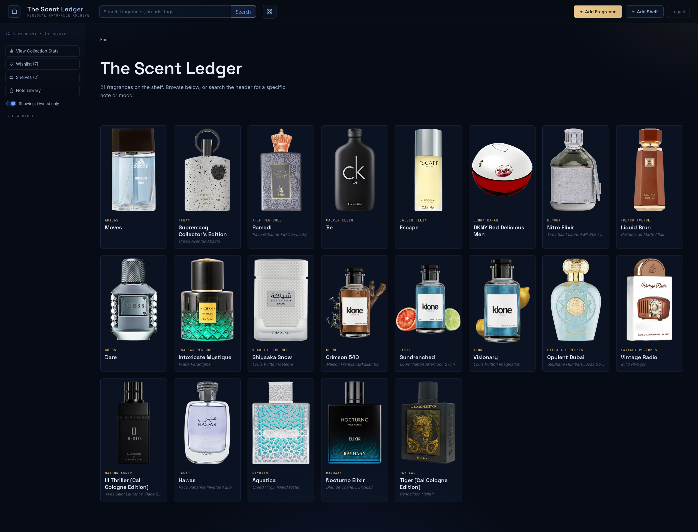
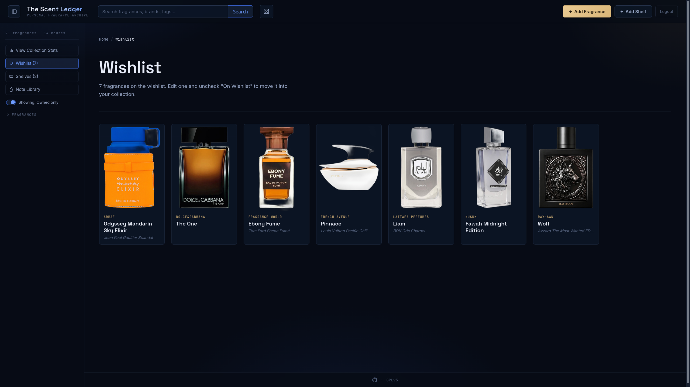
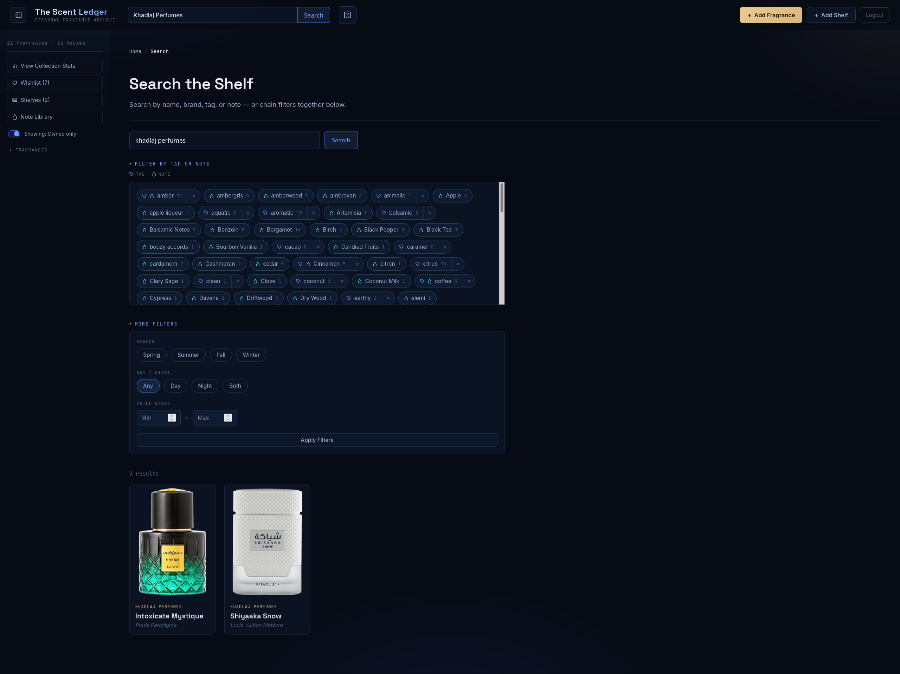
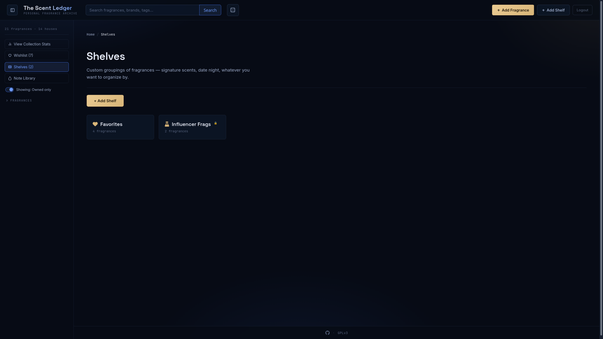
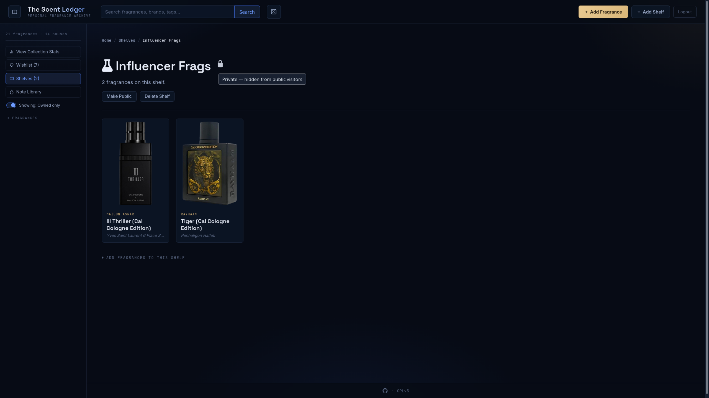
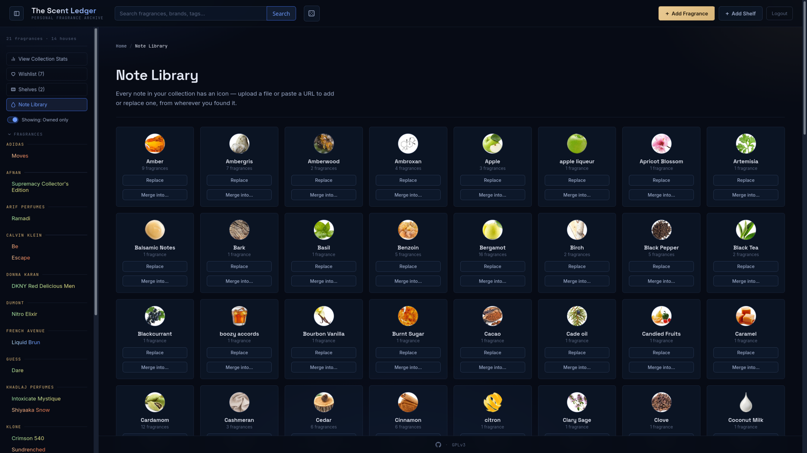
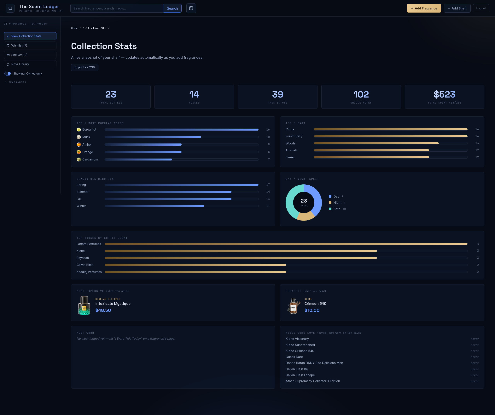
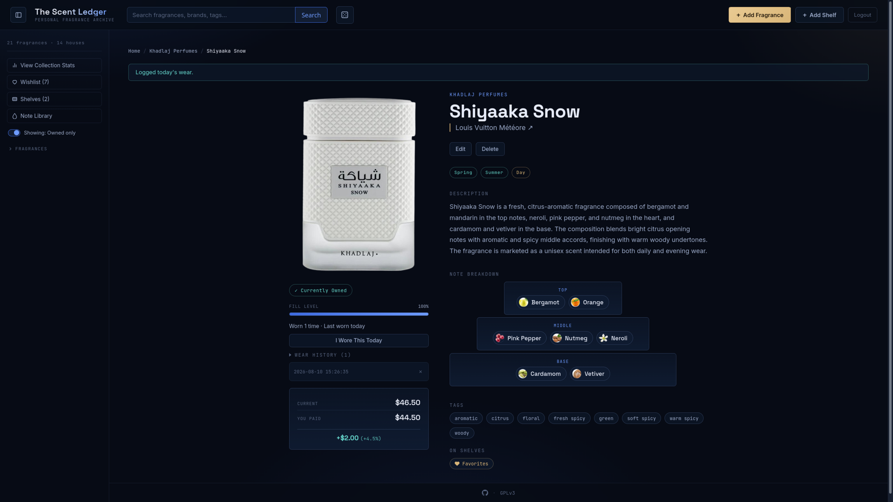
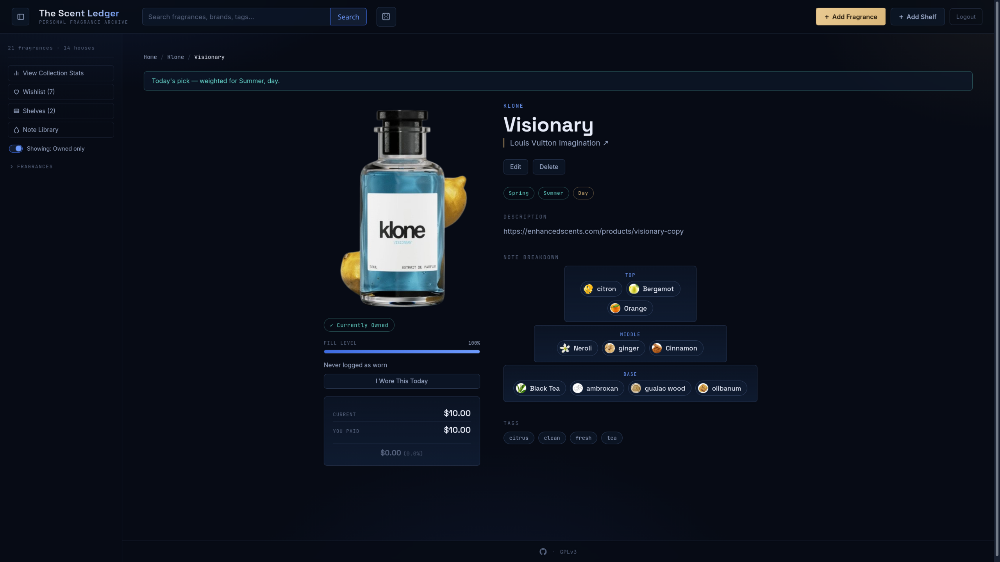
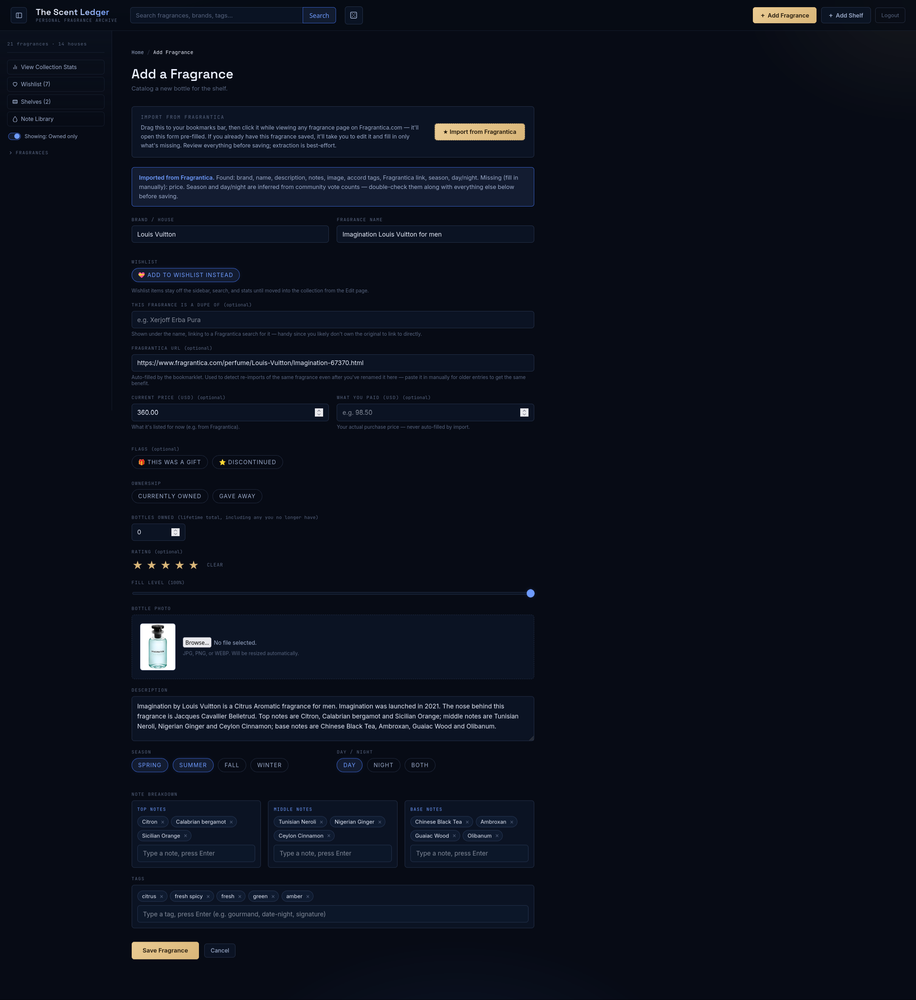

<div align="center">


</div>

# The Scent Ledger

A personal fragrance collection catalog. Flask + SQLite backend, server-rendered
Jinja templates, packaged for gunicorn behind Docker.

This is 100% slop-coded and I won't lie or try to hide it. This was a personal
project that I uploaded for ease-of-use and a potential case that anyone might</details>
want to use it. This repo is provided with no guarantees of any kind regarding
this project.

<details>
<summary>Screenshots</summary>












</details>

## Features

- Header
	- Manual fragrance add/shelf add
	- Randomizer that weighs season/time of day
- Homepage
	- 'Cards' show bottle, house name, fragrance name
	- Shows original if entry is a dupe fragrance/links to Fragrantica
	- Toggle to show currently owned only
- Bottle page
	- Notes and tags
	- Currently owned/gave away
	- How many bottles owned if not currently owned
	- Price information/gifted or not
	- Any shelves the fragrance is on
	- Fill level
	- Star rating
	- Wore today/number of times worn/history of wears
- Search function
	- Chainable tags, edit/delete
	- Faceted search by house, fragrance, tag, note, season, day/night, price
- Shelves
	- FontAwesome included for images
	- Per-shelf privacy
- Wishlist
	- Remove when purchased without recreating
- Collection Stats
	- Totals for bottles, houses, tags, notes, money spent
	- Top notes, tags, houses, season distribution, day/night split
	- Most/least expensive
	- Most worn/needs love
	- Database export to CSV
- Fragrantica Bookmarklet
	- Invoke on a Fragrantica fragrance page to supply 'Add Fragrance' form
	- Form is pre-filled with information from the fragrance page
	- Bottle images have background automatically removed
- Note Library
	- Ability to merge notes in case of non-obvious duplicates
	- Ability to add/change note images
	- Distinction between tags/notes with images
- Admin Login
	- All add/edit/delete functions are protected by login to allow public-facing
	- Protected shelves are invisible publicly

## Project layout

```
scent-ledger/
├── app.py                 # Flask app, all routes + SQLite queries
├── schema.sql              # Database schema (fragrances, seasons, notes, tags, note_images)
├── requirements.txt
├── gunicorn.conf.py
├── Dockerfile
├── docker-compose.yml
├── static/
│   ├── style.css
│   ├── app.js               # sidebar toggle + chip input widget
│   └── uploads/              # uploaded bottle photos (persisted via volume)
├── templates/
│   ├── base.html, index.html, detail.html, form.html, search.html, 404.html
└── data/                    # SQLite database file lives here (persisted via volume)
```

The database is created automatically at `data/scent_ledger.db` on first run.

## Run with Docker Compose (recommended)

```bash
services:
  scent-ledger:
    image: ghcr.io/hxck/scent-ledger:latest
    ports:
      - 8000:8000
    environment:
      SECRET_KEY: change-me-to-something-random
      # Admin login for Add/Edit/Delete — required.
      ADMIN_USERNAME: admin
      ADMIN_PASSWORD: change-me-to-something-random
      # Uncomment once this is served over HTTPS
      # SESSION_COOKIE_SECURE: "true"
    volumes:
      - scent_ledger_data:/app/data
      - scent_ledger_uploads:/app/static/uploads
    restart: unless-stopped
    #healthcheck:
    #  test:
    #    - CMD
    #    - python3
    #    - -c
    #    - import urllib.request;
    #      urllib.request.urlopen('http://localhost:8000/healthz')
    #  interval: 30s
    #  timeout: 5s
    # retries: 3
    #  start_period: 10s
volumes:
  scent_ledger_data: null
  scent_ledger_uploads: null
networks: {}

```

## Configuration (environment variables)

| Variable               | Default                         | Purpose                                   |
|-------------------------|---------------------------------|--------------------------------------------|
| `DATABASE_PATH`         | `./data/scent_ledger.db`        | SQLite file location                       |
| `UPLOAD_FOLDER`         | `./static/uploads`              | Where bottle photos are saved              |
| `SECRET_KEY`            | `dev-secret-change-me`          | Flask session signing key — **set a real one** |
| `ADMIN_USERNAME`        | `admin`                         | Login for Add/Edit/Delete                  |
| `ADMIN_PASSWORD`        | `changeme`                      | **Change this.** Logs a startup warning if left default |
| `SESSION_COOKIE_SECURE` | `false`                         | Set `true` once served over HTTPS          |
| `PORT`                  | `8000`                          | Port gunicorn binds to                     |
| `GUNICORN_WORKERS`      | `1`                              | See note below on SQLite + concurrency     |
| `GUNICORN_THREADS`      | `4`                              | Threads per worker                         |

## Backing up your data</details>

Backing up:
```bash
docker compose cp scent-ledger:/app/data/scent_ledger.db ./backup.db
docker compose cp scent-ledger:/app/static/uploads ./uploads_backup
```

Restoring:

```bash
docker compose up -d
docker compose cp ./backup.db scent-ledger:/app/data/scent_ledger.db
docker compose cp ./uploads_backup/. scent-ledger:/app/static/uploads/
docker compose restart
```
